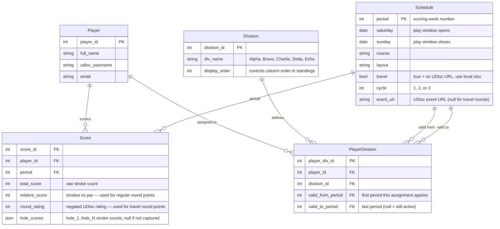

### Chester County Disc Golf
# Scorekeeping 2026

Scorekeeping tools customized for and by [Chester County Disc Golf](https://www.chestercountydiscgolf.org/) volunteers.

---

## How It Works

The utility runs once a week (typically Monday morning) after the Sunday play window closes. Each run:

1. **Syncs the schedule** — reads the season schedule Google Sheet and updates the local SQLite database with course, date, cycle, and UDisc event URL for each scoring period.
2. **Syncs registrations** — reads the player registration Google Sheet, adds any new players to the database, and assigns each player to their division for the current cycle.
3. **Imports scores** — for each completed period that hasn't been scored yet, downloads the UDisc leaderboard (or loads a local xlsx for travel rounds) and stores scores in the database.
4. **Backs up the database** — uploads the SQLite `.db` file to a designated Google Drive folder.
5. **Publishes standings** — calculates and writes three tabs to the public Google Sheets standings spreadsheet:
   - **Scores** — raw relative score by player and period
   - **Points** — points earned per period, cycle totals, and points-after-drops
   - **Weekly Avg** — each player's average points per week played

### Scoring Algorithm — "Percentage + Marnie"

Each period awards up to **150 points** per player, split across two components:

| Component | Max pts | Description |
|-----------|---------|-------------|
| Percentage | 120 | Rewards placement rank as a percentage of field size |
| Score-based | 30 | Rewards margin of victory relative to the field range |

Ties are resolved by averaging the points that would have been awarded across the tied positions.

### Cycles and Drops

The season is divided into **three cycles of 12 periods each**. Within each cycle, only a player's **best 6 scores** count toward their cycle total (points-after-drops). At the end of each cycle, players are rebalanced across divisions based on their results.

### Travel Rounds

For travel rounds (away tournaments with no UDisc event URL), the scorekeeper manually exports the combined leaderboard from UDisc, **negates the round ratings** (so that higher-is-better becomes lower-is-better, consistent with the regular scoring algorithm), and places the file locally before running the utility. Set `local_xlsx_path` in the scoring loop in `ccdg__main_2026.py` to point to that file.

### Standings Filters

Scores are stored for **all registered players** regardless of payment or division status. Players are excluded from the *published* standings only if:
- Their payment status is not `"paid"`, or
- They have not yet been assigned a division (`"Unknown"`)

Once they pay and are assigned a division, they will automatically appear in standings on the next run.

---

## Setup

### Prerequisites

- Python 3.12 or later
- A Google Cloud service account with access to the relevant Sheets and Drive folders (see [Google API setup guide](https://docs.google.com/document/d/1obuwpJykyDmwbKyDOIOFzF-EHP-qpMCDVK81Q01vock/edit?usp=sharing))

### First-time setup

1. **Clone the repository**
   ```
   git clone <repo-url>
   cd CCDG-Scorkeeping2026
   ```

2. **Create and activate a virtual environment**
   ```
   python -m venv .venv
   .venv\Scripts\activate        # Windows
   source .venv/bin/activate     # macOS / Linux
   ```

3. **Install dependencies**
   ```
   pip install -r requirements.txt
   ```

4. **Configure your environment**

   Copy `.env.example` to `.env` and fill in your values:
   ```
   cp .env.example .env
   ```

   `.env` settings:

   | Variable | Description | Default |
   |----------|-------------|---------|
   | `CCDG_CREDS_FILE` | Path to the Google service account JSON key | `google_apis/google_creds_svc_acct.json` |
   | `DEV_MODE` | `true` = use dev DB and dev standings sheet; `false` = live production run | `true` |

5. **Place your Google service account key** at `google_apis/google_creds_svc_acct.json` (or update `CCDG_CREDS_FILE` in `.env` to point to it elsewhere). This file is gitignored and must never be committed.

6. **Run the utility**
   ```
   python ccdg__main_2026.py
   ```

---

## Weekly Social Media Summary

After each scoring run the utility automatically calls the Google Gemini API to write a short, enthusiastic summary of the week — winners per division, any aces, close finishes, and standings movement. The summary is saved to `temp/CCDG_2026_Summary_Week<N>.txt` for a committee member to review and post.

### Setup

1. Get a free API key at [aistudio.google.com/apikey](https://aistudio.google.com/apikey)
2. Add it to your `.env`:
   ```
   GEMINI_API_KEY=your-key-here
   ```
   If the key is absent the summary step is silently skipped — the rest of the run is unaffected.

### Customising the prompt

The prompt lives in [prompts/weekly_summary.txt](prompts/weekly_summary.txt). Edit it freely — it is a plain text file tracked in git so changes are versioned. The only rule: keep the `{weekly_data}` placeholder somewhere in the file; that is where the week's stats are injected.

Examples of things you can tweak:
- Tone (more formal / more casual)
- Length (shorter for Twitter/X, longer for Facebook)
- What to emphasise (e.g. "always mention the course", "call out the division leader by name")
- Language style (add "use emojis", "write in the style of a sports broadcaster", etc.)

### Experimenting with the prompt

Use `ccdg_sidehatch.py` to test prompt changes without re-running the full weekly pipeline. It reads from the existing database — no score syncing, no Google Sheets calls.

Uncomment the relevant line in `main()` inside [ccdg_sidehatch.py](ccdg_sidehatch.py), then run:

```
python ccdg_sidehatch.py
```

Available options (see the `--- WEEKLY SUMMARY ---` block in `main()`):

```python
regenerate_summary(db, exe_dir)                          # latest period
regenerate_summary(db, exe_dir, period=5)                # specific period
regenerate_summary(db, exe_dir, dry_run=True)            # preview prompt only, no API call
regenerate_summary(db, exe_dir, period=5, dry_run=True)  # combine both
```

**Typical workflow:**
1. Uncomment `regenerate_summary(db, exe_dir, dry_run=True)` and run — confirms the data Gemini receives looks right
2. Edit `prompts/weekly_summary.txt` (tone, length, emphasis, etc.)
3. Switch to `regenerate_summary(db, exe_dir)` and run — see the generated summary
4. Repeat until happy — the next full weekly run picks up the updated prompt automatically

### Changing the Gemini model

The model is set in `ccdg_settings.py` under `GEMINI_MODEL` (default: `gemini-2.0-flash`). Any model available in your Google AI Studio account can be used — see the [Gemini model docs](https://ai.google.dev/gemini-api/docs/models) for options.

---

## Running Tests

The test suite covers the scoring algorithm and player utility functions. Tests require no database, no Google credentials, and no internet connection — they run in about 2 seconds.

### Run all tests

```
pytest tests/ -v
```

Expected output:
```
tests/test_players.py::TestCleanPlayerName::test_strips_leading_trailing_whitespace PASSED
tests/test_players.py::TestCleanPlayerName::test_title_cases_name PASSED
... (36 tests total)
============================= 36 passed in 1.86s ==============================
```

### What's tested

| File | Class | What it covers |
|------|-------|----------------|
| `tests/test_scoring.py` | `TestCalcPointsForPeriod` | Points algorithm: winners, ties, missing scores, divide-by-zero guard |
| `tests/test_scoring.py` | `TestTallyCycleTotals` | Drops logic: best-6-of-12, prior-cycle isolation, rounding |
| `tests/test_scoring.py` | `TestBuildAvgPointsRows` | Weekly average: zero weeks excluded, alphabetical sort |
| `tests/test_players.py` | `TestCleanPlayerName` | Name normalisation: whitespace, case, @, quotes |

### If a test fails

A failure means either the code changed in a way that breaks a league rule, or the test needs updating because the rule itself changed. Either way, **do not run a live scoring week with failing tests** — investigate the failure first.

Example failure output:
```
FAILED tests/test_scoring.py::TestCalcPointsForPeriod::test_winner_gets_max_points
AssertionError: assert 130.5 == 150
```
This tells you exactly which scenario broke and what value was produced vs. expected.

### One interesting behaviour worth knowing

A player who is the **only entrant** in a period receives 120 points (full percentage component), not 150. The score-based component (30 pts) requires at least two different scores to calculate a margin — with one player there is no range to measure. This is by design and is covered by `test_single_player_gets_full_percentage_points`.

---

## Weekly Run Checklist

1. Confirm `.env` has `DEV_MODE=false` for a live run (or `true` to test against the dev spreadsheet).
2. For **travel rounds**: download the UDisc leaderboard xlsx, negate the round ratings, and set `local_xlsx_path` in `ccdg__main_2026.py` before running.
3. Run `python ccdg__main_2026.py`.
4. Check the terminal output and `logs/YYYY-MM-DD.log` for any warnings.
5. Verify the public standings spreadsheet updated correctly.

---

## Project Structure

```
ccdg__main_2026.py      — entry point; orchestrates each weekly run
ccdg_settings.py        — all configuration (sheet IDs, scoring constants, DB paths)
ccdg_sidehatch.py       — end-of-cycle tools: rebalancing, payouts, aces report

ccdg/
  ccdg_schedule.py      — syncs schedule and division definitions from Google Sheets
  ccdg_players.py       — manages player registration and division assignments
  ccdg_scores.py        — imports UDisc scores and queries them for standings
  ccdg_standings.py     — scoring algorithm and standings sheet generation

sql_db/
  models.py             — SQLAlchemy ORM models (Schedule, Player, Division, Score)
  ccdg_db.py            — database session context manager and migration helper

google_apis/
  google_tasks.py       — Google Sheets read/write and Google Drive upload helpers

logger/
  logger.py             — shared logger (file + console handlers)
```

### Database schema

- **Schedule** — one row per scoring period (week): dates, course, cycle, UDisc URL
- **Player** — one row per registered player: name, email
- **Division** — the five skill divisions for the season (Alpha → Echo)
- **PlayerDivision** — maps a player to a division for a range of periods; supports mid-season rebalancing without losing history
- **Score** — one row per player per period: total strokes, relative score, round rating, hole-by-hole scores (JSON)

https://dbdiagram.io/d/69c958c778c6c4bc7a93a1d6




---

## Technical Notes

- **DEV_MODE**: controlled via `.env`. When `true`, the utility reads/writes a separate dev database and a private dev copy of the standings spreadsheet, leaving the live public sheet untouched.
- **Score storage**: hole scores are stored as a JSON dict (`{"hole_1": 3, "hole_2": 4, ...}`) directly on the Score row, supporting layouts with any number of holes.
- **Division history**: `PlayerDivision` rows use `valid_from_period` / `valid_to_period` ranges so a player's division at any historical period can be reconstructed accurately.
- **Idempotency**: every sync function (schedule, players, divisions) is safe to run multiple times — existing rows are skipped, not duplicated.
